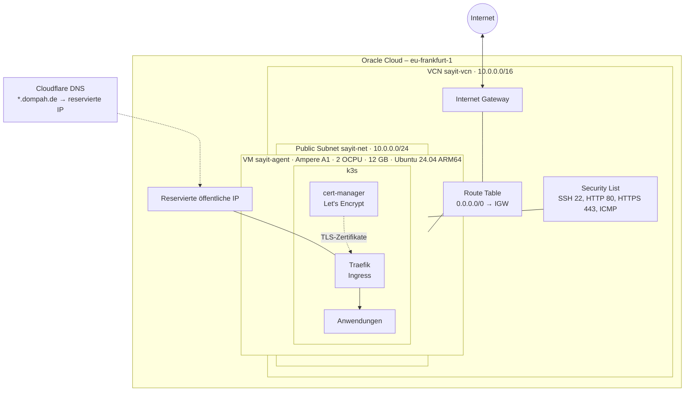

# oracle-platform

Infrastructure as Code für meine persönliche DevOps-Plattform auf **Oracle Cloud Infrastructure (OCI)**.
Die Plattform dient als gemeinsame Grundlage für meine Portfolio-Projekte – angefangen mit **SayIt**, einem Sprach-zu-Sprach-KI-Agenten.

Ziel des Projekts ist es, den kompletten Weg von der Infrastruktur bis zur laufenden Anwendung selbst aufzubauen und zu verstehen: Infrastruktur als Code, Container-Orchestrierung, automatisierte Deployments und Monitoring.

---

## Architektur



### Verwaltete Ressourcen

| Ressource | Terraform-Name | Beschreibung |
|---|---|---|
| Virtual Cloud Network | `oci_core_vcn.sayit` | Privates Netzwerk, `10.0.0.0/16` |
| Internet Gateway | `oci_core_internet_gateway.sayit` | Verbindung des VCN zum Internet |
| Route Table | `oci_core_route_table.sayit` | Leitet ausgehenden Verkehr über das Internet Gateway |
| Security List | `oci_core_security_list.sayit` | Firewall auf Netzwerkebene (eingehend: SSH, HTTP, HTTPS, ICMP) |
| Subnet | `oci_core_subnet.sayit` | Öffentliches Subnet, `10.0.0.0/24` |
| Compute Instance | `oci_core_instance.sayit_agent` | ARM-VM im Always-Free-Kontingent |
| Reserved Public IP | `oci_core_public_ip.sayit` | Feste öffentliche IP für DNS-Einträge |

Alle Ressourcen liegen im **Always-Free-Kontingent** von OCI (Ampere A1 mit 2 OCPU / 12 GB, 100 GB Boot Volume).

---

## Projektstruktur

```
oracle-platform/
├── terraform/
│   ├── providers.tf                # Provider-Konfiguration (oracle/oci)
│   ├── variables.tf                # Eingabevariablen
│   ├── network.tf                  # VCN, Internet Gateway, Route Table, Security List, Subnet
│   ├── compute.tf                  # VM und reservierte öffentliche IP
│   ├── data.tf                     # Data Sources (Image-Suche, VNIC, private IP)
│   ├── outputs.tf                  # Ausgaben (z. B. öffentliche IP)
│   ├── terraform.tfvars.example    # Vorlage für eigene Werte
│   └── .terraform.lock.hcl         # Fixierte Provider-Version
├── k3s/
│   ├── config.yaml                 # k3s-Konfiguration (/etc/rancher/k3s/config.yaml)
│   └── README.md                   # Installation inkl. Firewall-Anpassung
├── cluster/
│   └── cert-manager/
│       ├── cluster-issuers.yaml    # Let's Encrypt (Staging + Prod)
│       └── README.md               # Installation und Nutzung von cert-manager
└── README.md
```

---

## Voraussetzungen

- [Terraform](https://developer.hashicorp.com/terraform/install) ≥ 1.5 (wegen `import`-Blöcken)
- Ein OCI-Konto mit einem **API-Key** für den eigenen Benutzer
- Eine lokale OCI-Konfiguration unter `~/.oci/config`:

```ini
[DEFAULT]
user=ocid1.user.oc1..<user-ocid>
fingerprint=<fingerprint>
tenancy=ocid1.tenancy.oc1..<tenancy-ocid>
region=eu-frankfurt-1
key_file=~/.oci/oci_api_key.pem
```

Der Provider liest seine Zugangsdaten ausschließlich aus dieser Datei. Es liegen keine Zugangsdaten im Repository.

---

## Nutzung

```bash
cd terraform

# Eigene Werte eintragen
cp terraform.tfvars.example terraform.tfvars

# Provider herunterladen
terraform init

# Änderungen anzeigen (liest den aktuellen Zustand live bei Oracle)
terraform plan

# Änderungen anwenden
terraform apply

# Öffentliche IP anzeigen
terraform output public_ip
```

---

## Entstehung: Import bestehender Infrastruktur

Die VM und das Netzwerk wurden zunächst manuell über die OCI-Konsole angelegt und anschließend **nachträglich in Terraform überführt** – ohne eine einzige Ressource neu zu erstellen.

Vorgehen:

1. `import`-Blöcke für die bestehenden Ressourcen definieren
2. Mit `terraform plan -generate-config-out=generated.tf` Code aus dem Ist-Zustand erzeugen
3. Generierten Code bereinigen:
   - feste OCIDs durch **Referenzen** zwischen Ressourcen ersetzen (z. B. `oci_core_vcn.sayit.id`)
   - Compartment-ID über eine Variable statt fest im Code
   - automatisch gesetzte Felder und Standardwerte entfernen
4. Prüfen, dass der Plan `0 to add, 0 to change, 0 to destroy` meldet
5. `terraform apply` übernimmt die Ressourcen in den State

Der abschließende `terraform plan` meldet *„No changes“* – Code und reale Infrastruktur stimmen überein.

---

## Schutzmechanismen

Ampere-A1-Kapazität ist bei OCI knapp. Eine versehentliche Neuerstellung der VM könnte daran scheitern. Deshalb:

- **`prevent_destroy = true`** auf VM und reservierter IP – Terraform bricht ab, statt sie zu löschen oder zu ersetzen.
- **`ignore_changes`** für Felder, deren Änderung bei OCI eine Neuerstellung erzwingen würde (Image, SSH-Key-Metadaten) sowie für von Oracle automatisch gesetzte Tags.
- Das Image wird über eine **Data Source** ermittelt (neuestes Ubuntu 24.04 für A1). Für die laufende VM ist das wirkungslos, bei einem späteren Neuaufbau wird aber automatisch ein aktuelles Image verwendet.

---

## Sicherheit

**Nicht im Repository** (siehe `.gitignore`):

- `terraform.tfstate` – enthält IDs und Details aller Ressourcen
- `terraform.tfvars` – persönliche Werte wie die Tenancy-OCID
- `~/.oci/` – API-Key und Konfiguration liegen ausschließlich lokal

**Auf der VM:**

- Login nur per SSH-Key, Passwort-Login deaktiviert
- Automatische Sicherheitsupdates (`unattended-upgrades`)
- Zwei Firewall-Ebenen: OCI Security List (Netzwerk) und `iptables` (Betriebssystem). Ports werden nur geöffnet, wenn ein Dienst sie benötigt.

---

## Roadmap

- [x] VM im Always-Free-Kontingent, Grundabsicherung, reservierte IP
- [x] Infrastruktur als Code mit Terraform (Import der bestehenden Ressourcen)
- [x] Kubernetes mit **k3s**
- [x] Ingress und automatische TLS-Zertifikate (**Traefik**, **cert-manager**, Let's Encrypt)
- [ ] CI/CD mit **GitHub Actions** (ARM64-Images, Deployment auf die VM)
- [ ] GitOps mit **Argo CD**
- [ ] Monitoring mit **Prometheus** und **Grafana**, erste SLOs
- [ ] Terraform-State in OCI Object Storage
- [ ] Erstes Projekt auf der Plattform: **SayIt** (LiveKit-Server und KI-Agent)

---

## Lizenz

Privates Lern- und Portfolio-Projekt.
