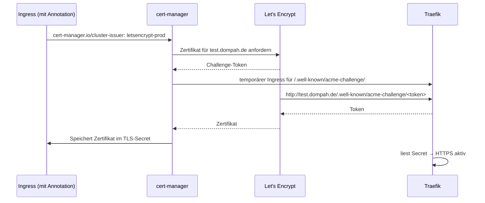

# cert-manager

Automatische TLS-Zertifikate von [Let's Encrypt](https://letsencrypt.org) für alle Ingresses im Cluster.
[cert-manager](https://cert-manager.io) ist ein CNCF-Projekt und erneuert Zertifikate selbstständig, bevor sie ablaufen.

---

## Funktionsweise



**Voraussetzungen:**

- DNS-Eintrag zeigt auf die öffentliche IP der VM (`*.dompah.de` → reservierte IP, Cloudflare **DNS only**)
- Port 80 und 443 in der OCI Security List geöffnet (siehe [`../../terraform/network.tf`](../../terraform/network.tf))

> Der Cloudflare-Proxy (orangene Wolke) muss für diese Domains aus sein. Sonst erreicht die HTTP-01-Validierung von Let's Encrypt nicht Traefik.

---

## Installation

```bash
sudo snap install helm --classic

helm repo add jetstack https://charts.jetstack.io --force-update

helm install cert-manager jetstack/cert-manager \
  --namespace cert-manager \
  --create-namespace \
  --set crds.enabled=true

kubectl -n cert-manager get pods
```

`crds.enabled=true` installiert die **Custom Resource Definitions**. Danach kennt Kubernetes neue Objekttypen wie `Certificate`, `Issuer` und `ClusterIssuer`.

Erwartete Pods:

| Pod | Aufgabe |
|---|---|
| `cert-manager` | Controller: holt und erneuert Zertifikate bei Let's Encrypt |
| `cert-manager-cainjector` | Verteilt CA-Daten an Kubernetes-Komponenten |
| `cert-manager-webhook` | Validiert Zertifikats-Ressourcen, bevor Kubernetes sie annimmt |

---

## ClusterIssuer

[`cluster-issuers.yaml`](cluster-issuers.yaml) definiert zwei Issuer, die in allen Namespaces gelten:

| Name | Zweck |
|---|---|
| `letsencrypt-staging` | Testumgebung – Zertifikate werden vom Browser nicht anerkannt, keine strengen Rate Limits |
| `letsencrypt-prod` | Echte, vertrauenswürdige Zertifikate – Let's Encrypt begrenzt die Anzahl der Anfragen |

```bash
kubectl apply -f cluster-issuers.yaml
kubectl get clusterissuers   # beide READY = True
```

Bewusst ohne E-Mail-Adresse: Sie ist optional und soll nicht im öffentlichen Repository stehen.

**Faustregel:** Neue Domains zuerst mit `letsencrypt-staging` testen, dann auf `letsencrypt-prod` umstellen.

---

## Nutzung in einer Anwendung

Ein Ingress bekommt ein Zertifikat, sobald er die Annotation und einen `tls`-Abschnitt hat:

```yaml
apiVersion: networking.k8s.io/v1
kind: Ingress
metadata:
  name: web
  namespace: test
  annotations:
    cert-manager.io/cluster-issuer: letsencrypt-prod
spec:
  ingressClassName: traefik
  tls:
    - hosts:
        - test.dompah.de
      secretName: test-dompah-de-tls
  rules:
    - host: test.dompah.de
      http:
        paths:
          - path: /
            pathType: Prefix
            backend:
              service:
                name: web
                port:
                  number: 80
```

Status beobachten:

```bash
kubectl -n test get certificate -w
```

Von Staging auf Prod wechseln: Annotation ändern, `kubectl apply`, dann das alte Secret löschen, damit sofort ein neues Zertifikat ausgestellt wird:

```bash
kubectl -n test delete secret test-dompah-de-tls
```

---

## Fehlersuche

```bash
kubectl -n <namespace> describe certificate <name>
kubectl -n <namespace> get certificaterequest,order,challenge
kubectl -n cert-manager logs deploy/cert-manager
```

Häufige Ursachen:

- DNS zeigt noch nicht auf die VM (`nslookup <domain>`)
- Port 80 nicht erreichbar (Security List oder Cloudflare-Proxy aktiv)
- Tippfehler in `apiVersion` (`cert-manager.io/v1`) oder YAML-Einrückung – der Webhook lehnt solche Ressourcen direkt ab
