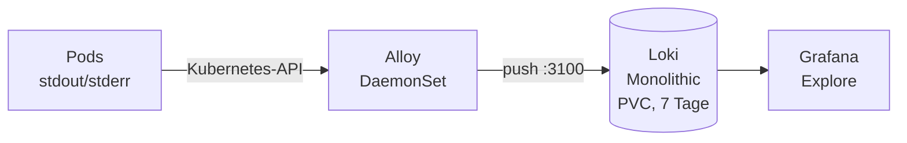

# Logging

Zentrale Logs aller Pods mit **Loki** und **Grafana Alloy**, abfragbar im bestehenden Grafana.

- Abfrage: `https://grafana.dompah.de` → **Explore** → Datenquelle **Loki**
- Namespace: `logging`
- Argo CD Applications: [`../apps/loki.yaml`](../apps/loki.yaml), [`../apps/alloy.yaml`](../apps/alloy.yaml)
- Charts: `grafana-community/loki` (Loki), `grafana/alloy` (Alloy) – feste Versionen, siehe Applications

---

## Komponenten

| Komponente | Aufgabe |
|---|---|
| **Alloy** | Log-Agent als DaemonSet (ein Pod pro Node). Findet alle Pods, liest ihre Logs über die Kubernetes-API, setzt Labels und schickt sie an Loki |
| **Loki** | Speichert und indiziert die Logs. Indiziert nur die **Labels**, nicht den Text – dadurch klein und sparsam |
| **Grafana** | Oberfläche zum Abfragen (aus dem kube-prometheus-stack, Loki als zusätzliche Datenquelle) |



**Pull vs. Push:** Prometheus holt sich Metriken selbst ab (Pull). Loki nimmt Logs nur entgegen (Push) – deshalb braucht es einen Agenten wie Alloy.

> Alloy ist der Nachfolger von Promtail (abgekündigt) und Grafanas Distribution des OpenTelemetry Collectors. Es kann später auch Metriken und Traces sammeln.

---

## Aufbau in Argo CD

Die Values liegen als eigene Dateien in diesem Ordner. Die Applications nutzen **zwei Quellen**:

1. das Helm-Chart aus dem Chart-Repository (gepinnte Version)
2. dieses Git-Repo mit `ref: values` – wird nicht selbst angewendet, sondern liefert nur die Values-Datei (`$values/cluster/logging/...`)

Vorteil: Genau dieselbe Datei lässt sich vor dem Push lokal testen.

```powershell
helm repo add grafana-community https://grafana-community.github.io/helm-charts
helm repo add grafana https://grafana.github.io/helm-charts
helm repo update

# Welche Objekte würden entstehen? (installiert nichts, braucht keinen Cluster)
helm template loki grafana-community/loki --version 18.15.1 -n logging -f cluster/logging/loki-values.yaml |
  Select-String '^kind:' | Group-Object Line | Select-Object Count, Name
```

Erwartet: genau ein `StatefulSet` (Loki), kein Memcached.

> **Hinweis:** Das Loki-Chart ist 2026 von `grafana/loki` nach `grafana-community/loki` umgezogen. Viele Anleitungen nutzen noch das alte Repo und veraltete Keys.

---

## Loki – wichtige Einstellungen

[`loki-values.yaml`](loki-values.yaml)

| Einstellung | Grund |
|---|---|
| `deploymentMode: Monolithic` | Ein Pod übernimmt alle Aufgaben – passend für einen einzelnen Node |
| `auth_enabled: false` | Kein Mandantenbetrieb, kein `X-Scope-OrgID`-Header nötig |
| `storage.type: filesystem` | Logs auf dem PVC statt in Object Storage (S3) |
| `schemaConfig` (`tsdb`, `v13`, `24h`) | Aktuelles Speicherformat, ein Index pro Tag |
| `retention_period: 168h` + `compactor.retention_enabled` | Logs werden nach 7 Tagen gelöscht. Ohne `retention_enabled` wirkt die Aufbewahrungsdauer nicht |
| `persistence` (10Gi, `local-path`) | Logs überleben Neustarts |
| `resources` (256Mi / Limit 1Gi) | Loki kann die VM nie leerfressen |
| `chunksCache`, `resultsCache`: `false` | Memcached-Caches – Standard **8 GB RAM**, auf einem Node unnötig |
| `lokiCanary`, `gateway`, `test`, `minio`: `false` | Test-Pods, Proxy und Objektspeicher werden nicht gebraucht |
| `replicas: 0` für alle anderen Komponenten | Nur relevant für die verteilten Modi – sicherheitshalber explizit aus |

> **Speichergröße:** `local-path` legt das Volume als Ordner auf der VM-Platte an und **erzwingt die 10 Gi nicht**. Loki kennt nur eine zeitbasierte Aufbewahrung. Begrenzt wird der Platz daher über die 7 Tage; die Platte überwacht Prometheus (`NodeFilesystemSpaceFillingUp`).
>
> Belegten Platz prüfen: `kubectl -n logging exec loki-0 -c loki -- du -sh /var/loki`

---

## Alloy – Pipeline

[`alloy-values.yaml`](alloy-values.yaml) – die Konfiguration steht in `alloy.configMap.content` und ist in **Alloy-Syntax** geschrieben (Kommentare mit `//`, nicht `#`).


| Baustein | Aufgabe |
|---|---|
| `discovery.kubernetes` | Fragt die Kubernetes-API nach allen Pods |
| `discovery.relabel` | Übernimmt `namespace`, `pod`, `container` aus den `__meta_kubernetes_*`-Metadaten als Labels |
| `loki.source.kubernetes` | Liest die Logs über die API – ohne `hostPath`-Zugriff auf das Dateisystem der VM |
| `loki.write` | Schickt an `http://loki.logging.svc.cluster.local:3100/loki/api/v1/push` |

Der Container `config-reloader` im Alloy-Pod lädt die Konfiguration automatisch neu, sobald sich die ConfigMap ändert.

---

## Grafana-Datenquelle

In [`../apps/monitoring.yaml`](../apps/monitoring.yaml) unter `grafana`:

```yaml
additionalDataSources:
  - name: Loki
    type: loki
    access: proxy
    url: http://loki.logging.svc.cluster.local:3100
```

`access: proxy` – der Grafana-Server fragt Loki ab, nicht der Browser. Nur so ist die interne Cluster-Adresse erreichbar.

---

## Abfragen (LogQL)

```logql
{namespace="sayit"}                                         # alle Logs des Agents
{namespace="argocd"} |= "error"                             # nur Zeilen mit "error"
{namespace="sayit", container="sayit-agent"} != "/health"   # ohne Health-Checks
sum by (namespace) (count_over_time({namespace=~".+"}[5m])) # Log-Zeilen pro Namespace
```

- `{…}` wählt die Streams über Labels aus (schnell, da indiziert)
- `|=` / `!=` filtern den Text (enthält / enthält nicht)
- `count_over_time`, `rate` machen aus Logs Zahlen – nutzbar für Graphen und Alarme

---

## Ressourcen

Gemessen nach der Installation:

| Pod | CPU | RAM | Limit |
|---|---|---|---|
| `alloy-*` | ~3m | ~55 Mi | 512 Mi |
| `loki-0` | ~5m | ~150 Mi | 1 Gi |

---

## Nützliche Befehle

```bash
kubectl -n logging get pods,pvc
kubectl -n logging logs ds/alloy --tail=20          # sendet Alloy ohne Fehler?
kubectl -n logging logs loki-0 -c loki --tail=20
kubectl top pods -n logging
```
