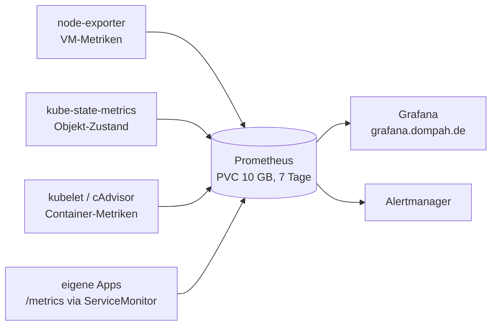

# Monitoring

Metriken, Dashboards und Alarme für Cluster und Anwendungen mit dem **kube-prometheus-stack**.

- Grafana: `https://grafana.dompah.de` (Benutzer `admin`)
- Namespace: `monitoring`
- Argo CD Application: [`../apps/monitoring.yaml`](../apps/monitoring.yaml)
- Chart: `prometheus-community/kube-prometheus-stack` (feste Version, siehe Application)

---

## Komponenten

| Komponente | Aufgabe |
|---|---|
| **Prometheus** | Fragt regelmäßig `/metrics`-Endpunkte ab (Pull-Prinzip) und speichert die Werte als Zeitreihen |
| **Grafana** | Dashboards und Abfragen auf Basis der Prometheus-Daten |
| **Alertmanager** | Verschickt und gruppiert Alarme aus den Prometheus-Regeln |
| **node-exporter** | Metriken der VM: CPU, RAM, Festplatte, Netzwerk |
| **kube-state-metrics** | Zustand der Kubernetes-Objekte: Pods, Deployments, Restarts … |
| **Prometheus Operator** | Controller mit CRDs wie `ServiceMonitor`, `PodMonitor`, `PrometheusRule` |



---

## Aufbau in Argo CD

Die Application nutzt **zwei Quellen** (Multi-Source):

1. das offizielle Helm-Chart mit eigenen Werten (`valuesObject`)
2. dieser Ordner – für zusätzliche Ressourcen wie das verschlüsselte Grafana-Passwort

Argo CD wendet aus diesem Ordner nur `.yaml`/`.yml`/`.json`-Dateien an – diese README wird ignoriert.

---

## Wichtige Einstellungen

| Einstellung | Grund |
|---|---|
| `kubeControllerManager`, `kubeScheduler`, `kubeProxy`, `kubeEtcd`: `enabled: false` | Bei **k3s** laufen diese Komponenten gemeinsam in einem Prozess und sind nicht einzeln abfragbar. Ohne Abschalten meldet Prometheus sie dauerhaft als „down“. |
| `prometheusSpec.storageSpec` | Persistenter Speicher (PVC, 10 GB, StorageClass `local-path`) – Messwerte überleben Neustarts |
| `retention: 7d`, `retentionSize: 8GB` | Alte Daten werden gelöscht, bevor die Platte vollläuft |
| `*SelectorNilUsesHelmValues: false` | Prometheus sammelt `ServiceMonitor`/`PodMonitor`/Regeln aus **allen** Namespaces, nicht nur aus diesem Chart |
| `ServerSideApply=true` | Die CRDs von Prometheus überschreiten das Größenlimit des klassischen `kubectl apply` |
| `grafana.admin.existingSecret: grafana-admin` | Admin-Zugang aus eigenem Secret statt aus einem zufällig erzeugten |

---

## Grafana-Admin-Passwort

Das Passwort liegt als **SealedSecret** in [`grafana-admin.yaml`](grafana-admin.yaml) – verschlüsselt, nur der Cluster kann es lesen.

**Passwort ändern:** neues SealedSecret erzeugen (siehe [`../sealed-secrets/README.md`](../sealed-secrets/README.md)), Datei ersetzen, pushen, danach:

```bash
kubectl -n monitoring rollout restart deployment monitoring-grafana
```

> Grafana speichert Benutzer und selbst gebaute Dashboards ohne eigenes Volume nur im Pod. Nach einem Neustart gilt wieder das Passwort aus dem Secret. Eigene Dashboards werden daher als Code (ConfigMap) angelegt, nicht in der Oberfläche.

---

## Eigene Anwendungen überwachen

Eine Anwendung stellt Metriken unter `/metrics` bereit (Python: `prometheus_client`). Damit Prometheus sie findet, bekommt ihr Helm-Chart einen `ServiceMonitor`:

```yaml
apiVersion: monitoring.coreos.com/v1
kind: ServiceMonitor
metadata:
  name: {{ .Release.Name }}
spec:
  selector:
    matchLabels:
      app: {{ .Release.Name }}
  endpoints:
    - port: http
      path: /metrics
      interval: 30s
```

---

## Nützliche Befehle

```bash
kubectl -n monitoring get pods
kubectl -n monitoring get pvc                       # Speicher von Prometheus (Bound)
kubectl top pods -A                                  # aktueller CPU-/RAM-Verbrauch
kubectl get servicemonitors -A                       # alle Ziele, die Prometheus abfragt
```

Hilfreiche mitgelieferte Dashboards in Grafana:

- **Node Exporter / Nodes** – Auslastung der VM
- **Kubernetes / Compute Resources / Namespace (Pods)** – CPU und RAM pro Pod
- **Kubernetes / Compute Resources / Cluster** – Gesamtübersicht
