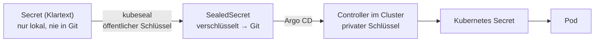

# Sealed Secrets

Secrets verschlüsselt in Git ablegen – auch in öffentlichen Repositories.

- Controller: `sealed-secrets-controller` im Namespace `kube-system`
- Argo CD Application: [`../apps/sealed-secrets.yaml`](../apps/sealed-secrets.yaml)
- Chart: `https://bitnami.github.io/sealed-secrets` (Projekt früher unter `bitnami-labs`)
- CLI: `kubeseal` (Version passend zum Controller)

---

## Prinzip



- Verschlüsselt wird mit dem **öffentlichen** Schlüssel des Controllers.
- Entschlüsseln kann **nur** der Controller mit seinem **privaten** Schlüssel.
- Ein SealedSecret ist an **Name und Namespace** gebunden – in einem anderen Namespace lässt es sich nicht entschlüsseln.

---

## kubeseal installieren (VM, ARM64)

```bash
cd /tmp
curl -fsSLO https://github.com/bitnami/sealed-secrets/releases/download/v0.40.0/kubeseal-0.40.0-linux-arm64.tar.gz
tar -xzf kubeseal-0.40.0-linux-arm64.tar.gz kubeseal
sudo install -m 755 kubeseal /usr/local/bin/kubeseal
kubeseal --version
```

---

## Secret verschlüsseln

```bash
read -s WERT                         # Wert unsichtbar einlesen, Enter
kubectl create secret generic <name> -n <namespace> \
  --from-literal=<schluessel>="$WERT" \
  --dry-run=client -o yaml \
  | kubeseal -o yaml > <name>.yaml
unset WERT
```

- `--dry-run=client -o yaml` erzeugt das Secret nur als Text – es landet nicht im Cluster.
- Die entstandene Datei in den passenden Ordner des Repos legen und pushen; Argo CD erledigt den Rest.

**Registry-Zugang (z. B. GHCR) als SealedSecret:**

```bash
read -s GHCR_TOKEN
kubectl create secret docker-registry ghcr-pull -n <namespace> \
  --docker-server=ghcr.io --docker-username=DomNicode \
  --docker-password="$GHCR_TOKEN" \
  --dry-run=client -o yaml \
  | kubeseal -o yaml > ghcr-pull.yaml
unset GHCR_TOKEN
```

---

## Schlüssel sichern

Geht der Cluster verloren, lassen sich ohne den privaten Schlüssel **keine** SealedSecrets mehr entschlüsseln.

```bash
kubectl -n kube-system get secret \
  -l sealedsecrets.bitnami.com/sealed-secrets-key -o yaml > sealed-secrets-key-backup.yaml
```

Die Datei sicher außerhalb von Git aufbewahren (Passwort-Manager) und auf der VM löschen.

**Wiederherstellung** auf einem neuen Cluster – **vor** der Installation des Controllers:

```bash
kubectl apply -f sealed-secrets-key-backup.yaml
```

> Der Controller erzeugt alle 30 Tage zusätzlich einen neuen Schlüssel (alte bleiben gültig). Die Sicherung daher regelmäßig erneuern.

---

## Im Einsatz

| SealedSecret | Namespace | Datei |
|---|---|---|
| `grafana-admin` | `monitoring` | [`../monitoring/grafana-admin.yaml`](../monitoring/grafana-admin.yaml) |
